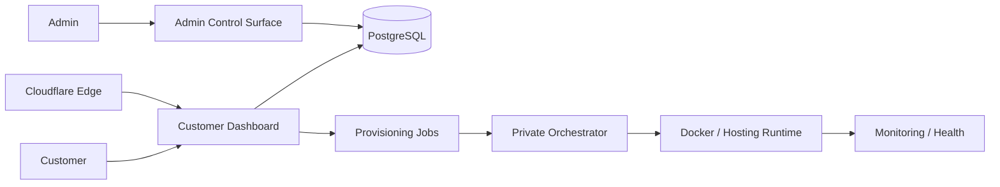

> **Visual overview:** conceptual case-study artwork based on the hosting and provisioning architecture. It does not expose live infrastructure, customer data, or private hostnames.

# Aya Cloud — VPS & Hosting Operations Platform

**Public engineering case study by [Levent Aydin](https://github.com/LEVENT-AY)**  
Senior Full-Stack, Mobile & AI Automation Engineer

> Production code, credentials, private hostnames, provisioning configuration, and customer data remain private.

## 30-second recruiter scan

- **System:** hosting-oriented customer and admin platform backed by durable provisioning jobs and a private infrastructure-orchestration boundary.
- **My ownership:** product architecture, customer/admin workflows, PostgreSQL data model, subscriptions/quotas/domains, Docker/Linux operations, edge routing, monitoring, and provisioning design.
- **What it proves:** I can connect SaaS product engineering to privileged infrastructure safely instead of letting a public web app directly control the host.

## At a glance

| | |
|---|---|
| **Application** | Next.js · React · TypeScript |
| **Data** | PostgreSQL · Prisma |
| **Runtime** | Docker · Docker Compose · Linux/WSL |
| **Edge** | Cloudflare controlled routing |
| **Provisioning** | Durable jobs · private orchestrator boundary |

## The engineering problem

A hosting platform has two very different responsibilities: give customers a clean self-service product experience, and give infrastructure enough authority to provision and operate real services safely.

The architecture therefore separates **public product UX, customer entitlements, provisioning intent, and privileged infrastructure execution**.

## Architecture

## What I built and owned

- Next.js product with React, TypeScript, authentication, and database-backed customer state.
- Hosting dashboard for service state, quotas, domains, and operations.
- Role-protected administration and subscription-plan foundation.
- Per-customer quota and usage models instead of hard-coded plan assumptions.
- Persisted domain-request and provisioning-intent workflows.
- Private orchestrator boundary that keeps Docker authority out of the public application.
- Docker/Linux operations, controlled Cloudflare ingress, monitoring, and health workflows.

## Verification evidence

The private source documents a **Next.js/React/TypeScript customer platform**, a Docker production container, Cloudflare-based ingress, explicit local-vs-production port separation, and build/deployment procedures. Security guidance keeps environment secrets and registrar/payment credentials server-side and explicitly prevents private server/admin URLs from leaking into customer-facing code.

Operational health is treated separately from source state: a process existing, a route being reachable, and the application behaving correctly are different checks.

## Key engineering decisions

### The web application must not control Docker directly
The public app persists provisioning intent; a separate trusted orchestrator owns privileged host actions.

### Entitlements belong in data
Plan defaults and effective customer quota are separate from usage so upgrades, overrides, and future automation remain safe.

### Runtime health is a product concern
A running container, a reachable route, and a healthy application are different states and are verified separately.

## Technology

| Layer | Technology / focus |
|---|---|
| Customer platform | Next.js, React, TypeScript |
| Data | PostgreSQL, Prisma |
| Provisioning | Durable jobs, private orchestrator |
| Runtime | Docker, Docker Compose, Linux / WSL |
| Edge | Cloudflare controlled routing |
| Operations | Monitoring, health checks, rollback-minded delivery |

## What this demonstrates

Aya Cloud demonstrates product engineering plus real infrastructure ownership: customer UX, entitlement models, privileged provisioning boundaries, Docker/Linux operations, networking, and production health.

---

**Source policy:** private for commercial, security, and infrastructure reasons. No credentials, IP addresses, private service URLs, customer data, or proprietary provisioning configuration are published here.

[← Back to my engineering profile](https://github.com/LEVENT-AY)
