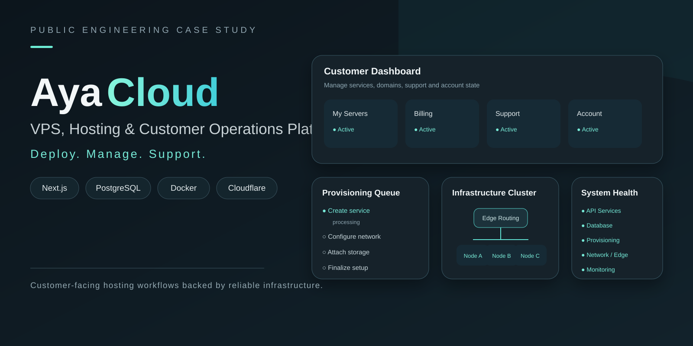
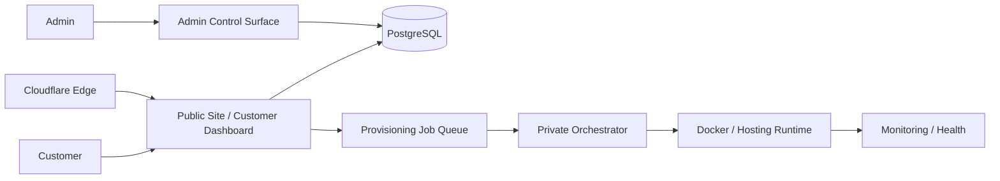

> **Visual overview:** conceptual case-study artwork based on the hosting and provisioning architecture. It does not expose live infrastructure, customer data, or private hostnames.

# Aya Cloud — VPS & Hosting Operations Platform

**Public engineering case study by [Levent Aydin](https://github.com/LEVENT-AY)**  
Senior Full-Stack, Mobile & AI Automation Engineer

> This repository is a public architecture showcase. Production code, credentials, private hostnames, provisioning configuration and customer data remain private.

## At a glance

| | |
|---|---|
| **Product type** | Hosting-oriented customer and operations platform |
| **Application** | Next.js · React · TypeScript |
| **Data** | PostgreSQL · Prisma |
| **Infrastructure** | Docker · Docker Compose · Linux/WSL |
| **Edge** | Cloudflare Tunnel and controlled private routing |
| **Provisioning model** | Persisted jobs + private orchestrator boundary |
| **My role** | Product architecture, customer/admin platform, data model, infrastructure, routing, monitoring and provisioning design |

## The engineering problem

A hosting platform has two very different responsibilities: provide customers with a clean self-service product experience, and give infrastructure enough authority to provision and operate real services safely.

The system therefore separates **public product UX, customer entitlements, background provisioning and private infrastructure tooling** instead of allowing a web application to directly control the host.

## Architecture

## What I built and owned

- Next.js App Router product with React and TypeScript.
- Authentication and database-backed customer models.
- Hosting-style customer dashboard for service state, quotas, domains and operations.
- Role-protected administration foundation for customers and subscription plans.
- Per-customer quota and usage models instead of hard-coded plan assumptions.
- Persisted domain-request workflows with controlled administrative review.
- Queue-oriented provisioning architecture that keeps Docker authority out of the public web application.
- Private orchestrator boundary for future VPS, container and site provisioning.
- Docker Compose-based operations on Linux/WSL.
- Cloudflare-based ingress without exposing arbitrary host ports publicly.
- Monitoring, health, container and file/status tooling kept outside customer-facing UX.
- Explicit separation of development and production runtime concerns.

## Core engineering decisions

### 1. The web application must not control Docker directly

Customer-facing application code writes provisioning intent to durable jobs. A separate trusted orchestrator owns privileged infrastructure actions.

### 2. Entitlements belong in data

Plan templates can define defaults, but effective customer quota is persisted independently from usage. This supports upgrades, overrides and future automation safely.

### 3. Private operations stay private

Monitoring and infrastructure-control surfaces are intentionally excluded from public customer navigation and documentation.

### 4. Runtime health is a product concern

Running containers, reachable routes and healthy application behavior are different states. Deployment and operations are designed around semantic health rather than process existence alone.

## Technology

| Layer | Technology / focus |
|---|---|
| Customer platform | Next.js, React, TypeScript |
| Data | PostgreSQL, Prisma |
| Provisioning | Durable job queue, private orchestrator boundary |
| Runtime | Docker, Docker Compose, Linux / WSL |
| Edge | Cloudflare Tunnel, controlled routing |
| Operations | Monitoring, health checks, rollback-minded delivery |
| Product model | Subscriptions, quotas, usage, domains, hosting controls |

## What this demonstrates

Aya Cloud demonstrates my ability to connect **SaaS product engineering with real infrastructure concerns**: customer experience, entitlement models, privileged provisioning boundaries, Docker/Linux operations, networking and production health.

---

**Source policy:** private for commercial, security and infrastructure reasons. No credentials, IP addresses, private service URLs, customer data or proprietary provisioning configuration are published here.

[← Back to my engineering profile](https://github.com/LEVENT-AY)
